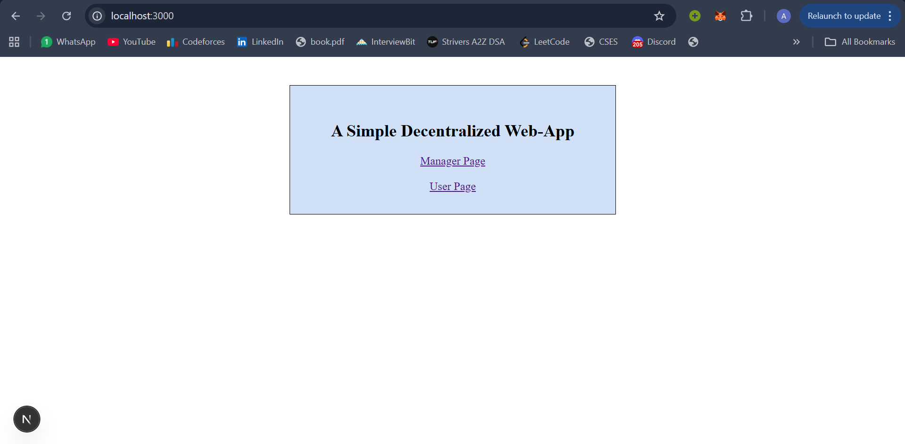
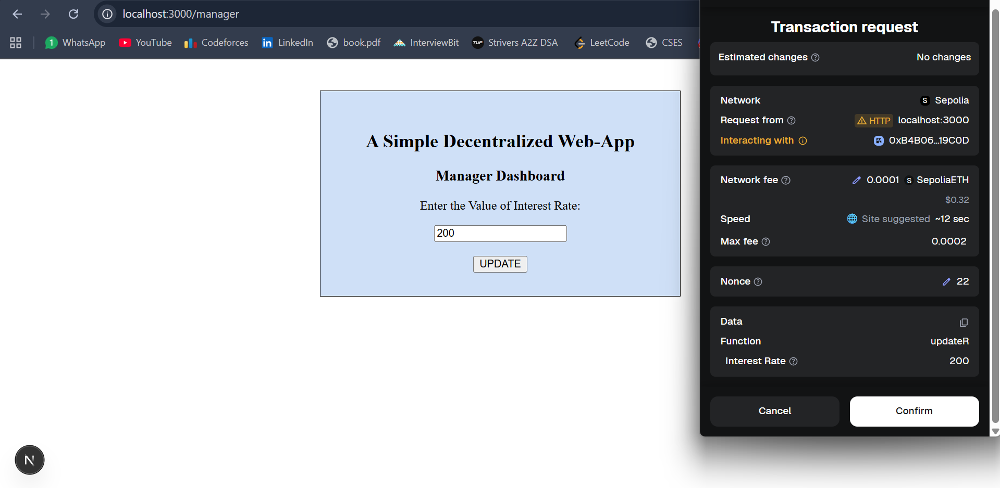
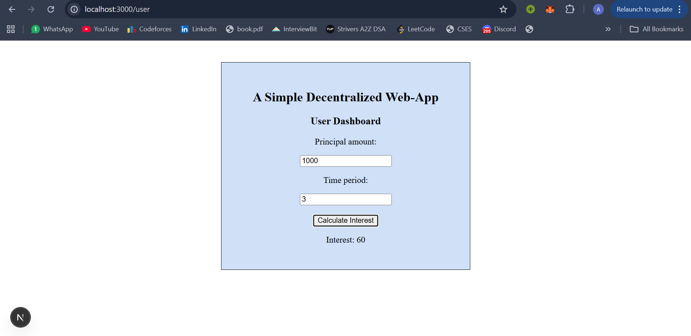
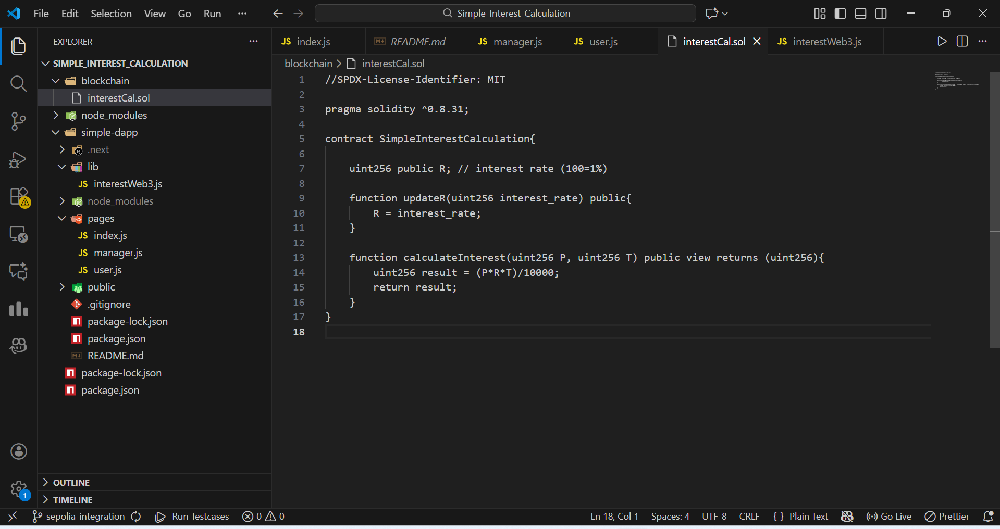

# 💰 Simple Interest Calculator DApp

> A decentralized application for calculating simple interest on the Ethereum blockchain

A full-stack Web3 application that demonstrates blockchain integration by calculating simple interest using smart contracts deployed on Ethereum Sepolia testnet. Perfect for learning decentralized application development! 🚀

---

## ✨ Features

- 👨‍💼 **Manager Dashboard**
  - Update the interest rate stored on the blockchain
  - Requires MetaMask transaction confirmation

- 👤 **User Dashboard**
  - Calculate simple interest using stored blockchain data
  - Read-only smart contract call (no gas required)

- 🔗 **Blockchain Powered**
  - Interest rate stored immutably on Ethereum
  - Transparent and trustless computation

- ⚡ **Simple & Clean UI**
  - Built using Next.js
  - Beginner-friendly layout

- 🧪 **Test Network Ready**
  - Deployed on **Ethereum Sepolia Testnet**
  - Uses free test ETH from faucets

---

## 📸 Screenshots

### 🏠 Home Page
<p align="center">
  
</p>

### 👨‍💼 Manager Dashboard
<p align="center">
  
</p>

### 👤 User Dashboard
<p align="center">
  
</p>

---

## 🏗️ Project Structure

<p align="center">
  
</p>
```


## 🛠️ Tech Stack

| Category | Technologies |
|----------|-------------|
| **Blockchain** | Solidity, Ethereum (Sepolia Testnet) |
| **Frontend** | Next.js 14, JavaScript, CSS3 |
| **Web3 Integration** | Web3.js 4.x |
| **Wallet** | MetaMask |
| **Development** | Remix IDE, Node.js, npm |

---

## 🚀 Quick Start

### Prerequisites

Before you begin, ensure you have:

- ✅ **Node.js** v16 or higher ([Download](https://nodejs.org/))
- ✅ **npm** or **yarn** package manager
- ✅ **MetaMask** browser extension ([Install](https://metamask.io/))
- ✅ **Sepolia ETH** from a faucet ([Get free ETH](https://sepoliafaucet.com/))

---

### Installation

**1. Clone the repository**
```bash
git clone https://github.com/wizard-2006/simple-interest-dapp.git
cd simple-interest-dapp/simple-dapp
```

**2. Install dependencies**
```bash
npm install
# or
yarn install
```

**3. Configure environment variables**

Create a `.env.local` file in the `simple-dapp/` directory:
```env
NEXT_PUBLIC_CONTRACT_ADDRESS=your_deployed_contract_address
NEXT_PUBLIC_NETWORK=sepolia
```

> 💡 **Tip:** Deploy the smart contract from `blockchain/interestCal.sol` using Remix IDE and paste the address above

**4. Start the development server**
```bash
npm run dev
# or
yarn dev
```

**5. Open your browser**

Navigate to [`http://localhost:3000`](http://localhost:3000)

---

### ⚙️ MetaMask Setup

1. 🦊 Install MetaMask browser extension
2. 🌐 Switch to **Sepolia Test Network**
3. 💧 Get free Sepolia ETH from a [faucet](https://sepoliafaucet.com/)
4. 🔗 Connect your wallet to the DApp

---

## 📖 How It Works

### Manager Workflow
1. Connect MetaMask wallet
2. Navigate to Manager Dashboard
3. Enter new interest rate
4. Confirm transaction in MetaMask
5. Rate is updated on the blockchain

### User Workflow
1. Connect MetaMask wallet
2. Navigate to User Dashboard
3. Enter principal, time period, and rate (or use blockchain rate)
4. Calculate interest instantly
5. No transaction required - it's a read-only operation!

---

## 🎓 Learning Outcomes

This project teaches you:

- ✅ Smart contract development with Solidity
- ✅ Frontend-blockchain integration using Web3.js
- ✅ MetaMask wallet connectivity
- ✅ Transaction signing and gas management
- ✅ Read vs. Write operations on blockchain
- ✅ Next.js application structure
- ✅ Environment variable management
- ✅ Testnet deployment and testing

Perfect for **college projects**, **blockchain assignments**, and **Web3 portfolio pieces**! 🎯

---


## 🤝 Contributing

Contributions are welcome! Feel free to:

1. 🍴 Fork the repository
2. 🌿 Create a feature branch (`git checkout -b feature/AmazingFeature`)
3. 💾 Commit your changes (`git commit -m 'Add some AmazingFeature'`)
4. 📤 Push to the branch (`git push origin feature/AmazingFeature`)
5. 🔃 Open a Pull Request

---

## 📄 License

This project is open source and available under the [MIT License](LICENSE).

---

- GitHub: [@wizard-2006](https://github.com/wizard-2006)

---

## ⭐ Show Your Support

If this project helped you learn Web3 development or complete your assignment:

- ⭐ **Star** this repository
- 🍴 **Fork** it for your own experiments
- 📢 **Share** it with fellow blockchain learners
- 💬 **Open issues** for questions or improvements

---

## 🙏 Acknowledgments

- [Ethereum Foundation](https://ethereum.org/) for blockchain infrastructure
- [MetaMask](https://metamask.io/) for wallet integration
- [Remix IDE](https://remix.ethereum.org/) for smart contract development
- [Next.js Team](https://nextjs.org/) for the amazing framework
- [Web3.js](https://web3js.org/) for blockchain connectivity

---

<div align="center">

**🚀 Happy Building with Web3! 🚀**

Made with ❤️ for blockchain learners and enthusiasts

[Report Bug](https://github.com/wizard-2006/simple-interest-dapp/issues) · [Request Feature](https://github.com/wizard-2006/simple-interest-dapp/issues)

</div>
